# 🌲 Master AWS Service Selection & Architecture Decision Trees

> **Source**: Compiled from your comprehensive AWS Learning Notes (Sections 4 – 31).  
> **Purpose**: A definitive, scenario-driven decision guide with **Mermaid Flowcharts**, **Decision Matrices**, and concrete **"If... Then..." Architecture Rules** to determine the exact AWS service for any architectural requirement.

---

## 📑 Table of Contents

1. [Domain 1: Compute & Container Hosting](#domain-1-compute--container-hosting)
2. [Domain 2: Storage & File Systems](#domain-2-storage--file-systems)
3. [Domain 3: Databases & In-Memory Caching](#domain-3-databases--in-memory-caching)
4. [Domain 4: Networking, Routing & Content Delivery](#domain-4-networking-routing--content-delivery)
5. [Domain 5: Messaging, Integration & Event Streaming](#domain-5-messaging-integration--event-streaming)
6. [Domain 6: Security, Encryption & Identity](#domain-6-security-encryption--identity)
7. [Domain 7: Monitoring, Auditing & Observability](#domain-7-monitoring-auditing--observability)
8. [Domain 8: DevOps, Infrastructure as Code & CI/CD](#domain-8-devops-infrastructure-as-code--cicd)
9. [Domain 9: API Management & Edge Computing](#domain-9-api-management--edge-computing)
10. [Domain 10: Big Data, Analytics & Specialized Services](#domain-10-big-data-analytics--specialized-services)

---

## Domain 1: Compute & Container Hosting

### 1.1 Compute Hosting Decision Tree

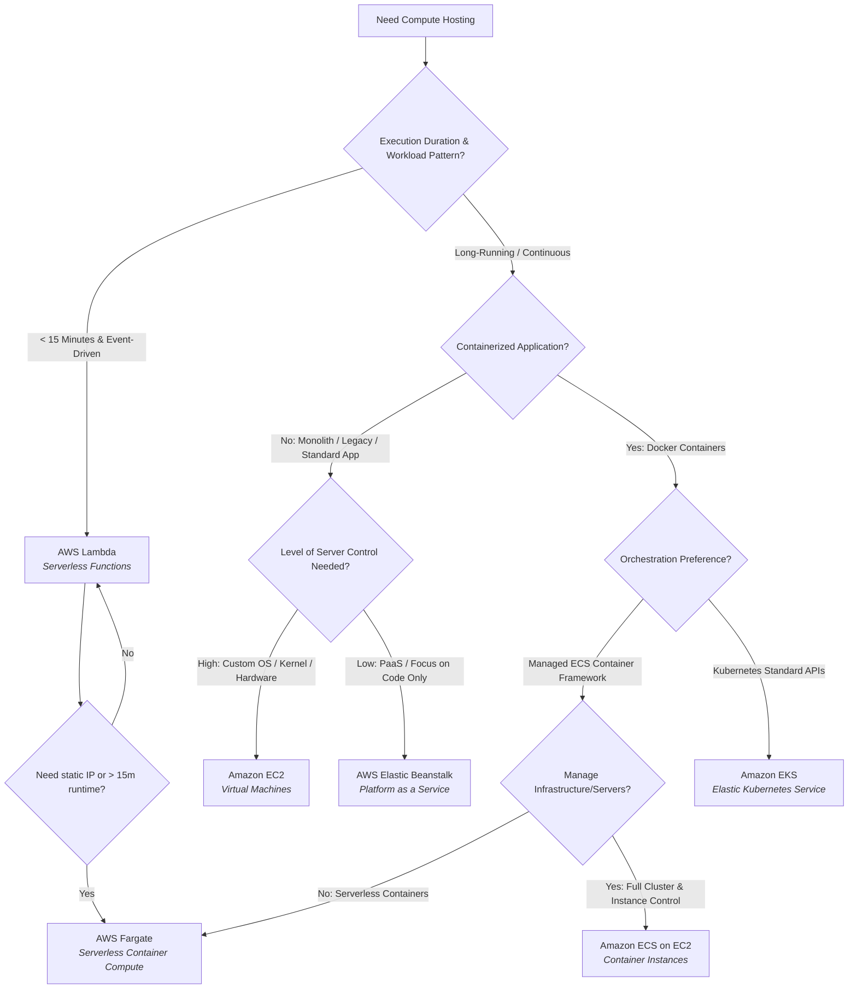

### 1.2 EC2 Purchasing Strategy Decision Tree

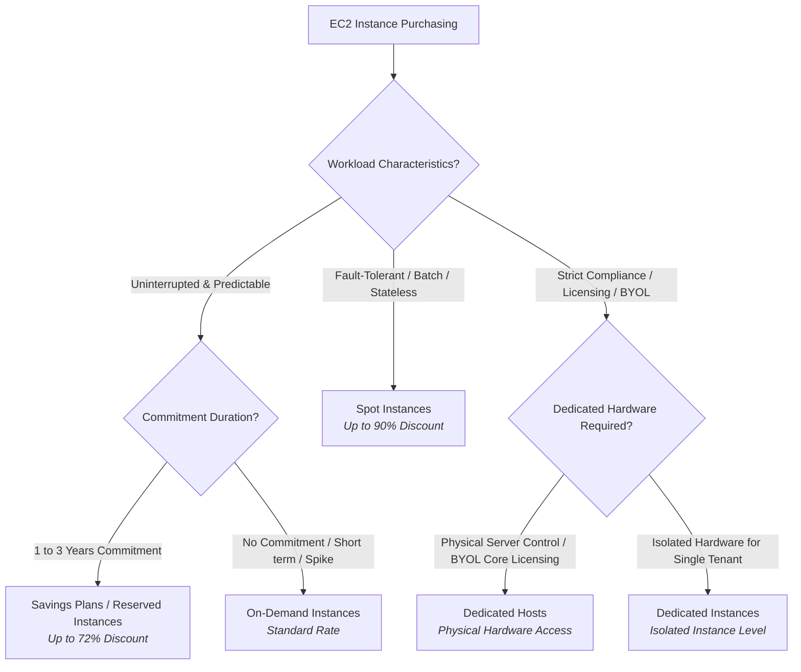

### 1.3 Compute Decision Matrix

| Requirement / Scenario | Primary Service | Alternative Service | Key Decision Rationale |
| :--- | :--- | :--- | :--- |
| **Event-driven execution under 15 minutes** | **AWS Lambda** | AWS Fargate | Zero server management; scales from 0 to thousands instantly; pay per millisecond. |
| **Containerized web apps without managing servers** | **AWS Fargate (ECS/EKS)** | AWS App Runner | No EC2 provisioning, patch management, or capacity planning required. |
| **Legacy monolithic app needing full root/OS access** | **Amazon EC2** | AWS Elastic Beanstalk | Full control over OS kernel, system drivers, custom network configurations. |
| **Rapid PaaS deployment of web server + DB** | **AWS Elastic Beanstalk** | AWS App Runner | Automatic provisioning, load balancing, auto-scaling, and environment updates. |
| **HPC / Machine Learning requiring GPUs** | **Amazon EC2 (P/G instances)** | AWS Batch | Direct hardware access to NVIDIA GPUs with custom CUDA drivers. |
| **Fault-tolerant batch jobs at minimal cost** | **EC2 Spot Instances** | AWS Batch on Spot | Up to 90% cheaper than On-Demand; handles 2-minute termination notifications. |

### 1.4 "If... Then..." Compute Rules
- **IF** execution time is $\le 15$ minutes and triggered by events (S3, SQS, API Gateway), **THEN** use **AWS Lambda**.
- **IF** workload requires custom Docker containers but zero EC2 server management, **THEN** use **ECS/EKS on AWS Fargate**.
- **IF** workload requires existing Kubernetes manifests (`kubectl`, Helm), **THEN** choose **Amazon EKS**.
- **IF** workload requires BYOL (Bring Your Own License) tied to physical CPU cores, **THEN** choose **EC2 Dedicated Hosts**.

---

## Domain 2: Storage & File Systems

### 2.1 Primary Storage Selection Decision Tree

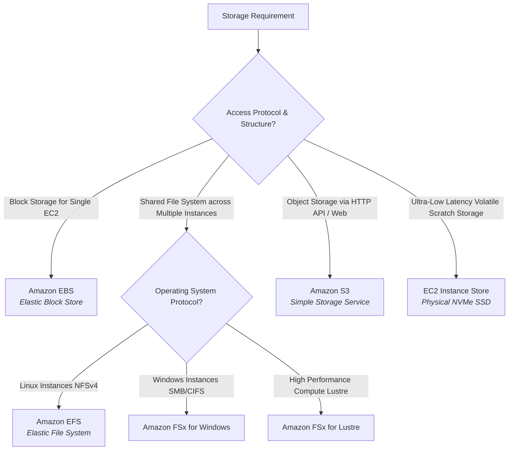

### 2.2 S3 Storage Class Lifecycle Decision Tree

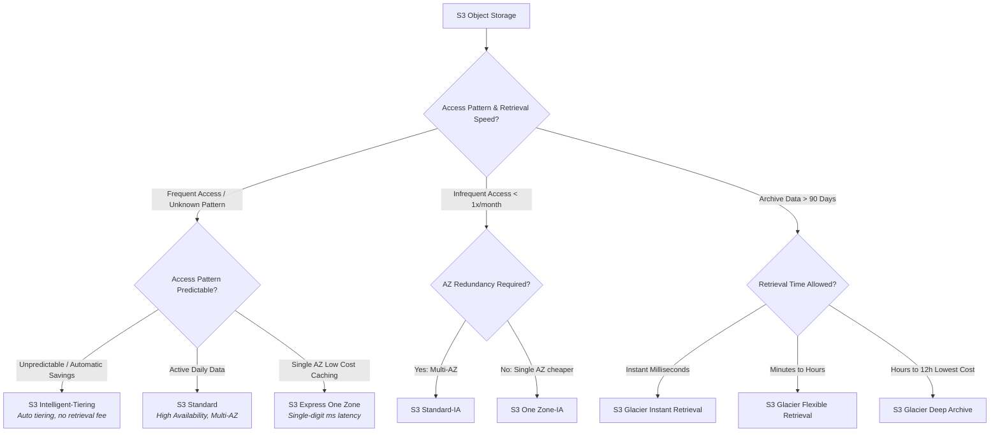

### 2.3 Storage Decision Matrix

| Requirement / Scenario | Primary Service | Alternative Service | Key Decision Rationale |
| :--- | :--- | :--- | :--- |
| **Persistent OS boot volume for EC2** | **Amazon EBS (gp3)** | EBS (io2) | High performance block store attached via network; supports snapshots. |
| **Shared POSIX storage for auto-scaling Linux servers** | **Amazon EFS** | EBS Multi-Attach | Concurrent read/write across 1000s of EC2 instances across multiple AZs. |
| **Ultra-fast temporary temporary storage (Buffer/Cache)** | **EC2 Instance Store** | EBS (io2 Block Express) | Physically attached to server hardware; maximum IOPS, but data lost on instance stop. |
| **Unstructured data storage (Images, Media, Backups)** | **Amazon S3** | Amazon EFS | Virtually infinite capacity, 99.999999999% (11 9's) durability, lifecycle policies. |
| **Long-term compliance archiving (10+ years)** | **S3 Glacier Deep Archive** | S3 Glacier Flexible | Lowest cost storage in AWS ($\sim \$0.00099$/GB/mo); 12-hour bulk retrieval. |
| **High Performance IOPS block storage for mission-critical DB** | **EBS io2 Block Express** | EBS gp3 | Delivers up to 256,000 IOPS and 4,000 MB/s throughput with sub-ms latency. |

### 2.4 "If... Then..." Storage Rules
- **IF** data is block-level and attached to a single EC2 instance, **THEN** use **EBS**.
- **IF** multiple Linux EC2 instances require concurrent read/write access to a shared directory, **THEN** use **EFS**.
- **IF** maximum IOPS is required and data loss on server stop/termination is acceptable, **THEN** use **EC2 Instance Store**.
- **IF** storing objects with unknown access patterns, **THEN** use **S3 Intelligent-Tiering** to avoid manual lifecycle tuning.

---

## Domain 3: Databases & In-Memory Caching

### 3.1 Database Selection Decision Tree

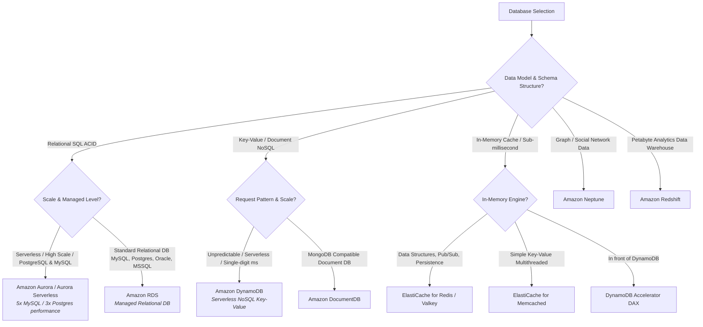

### 3.2 Database & Caching Decision Matrix

| Requirement / Scenario | Primary Service | Alternative Service | Key Decision Rationale |
| :--- | :--- | :--- | :--- |
| **High-throughput OLTP app requiring MySQL/Postgres compatibility with instant auto-scaling** | **Amazon Aurora Serverless v2** | Amazon RDS | Auto-scales compute capacity in fine-grained increments; 15 read replicas with $<10$ms replication lag. |
| **Fully managed NoSQL for serverless apps with unpredictable traffic** | **Amazon DynamoDB** | Amazon DocumentDB | On-Demand capacity mode; seamless scaling to millions of requests/sec with predictable single-digit ms latency. |
| **Sub-millisecond read caching for complex data structures (sets, sorted sets)** | **ElastiCache for Redis** | ElastiCache for Memcached | Supports rich data types, replication, multi-AZ failover, and persistence snapshots. |
| **Sub-millisecond read cache dedicated for DynamoDB queries** | **DynamoDB Accelerator (DAX)** | ElastiCache for Redis | Seamless inline microsecond cache; requires zero code changes to DynamoDB API calls. |
| **Complex analytical queries on petabytes of structured historical data** | **Amazon Redshift** | Amazon Athena | Columnar storage, massively parallel processing (MPP) data warehouse. |

### 3.3 "If... Then..." Database Rules
- **IF** workload requires relational ACID compliance with minimum operational overhead and auto-scaling, **THEN** use **Amazon Aurora Serverless**.
- **IF** workload requires key-value lookup with guaranteed single-digit millisecond latency at any scale, **THEN** use **DynamoDB**.
- **IF** application requires in-memory caching with multi-AZ failover and pub/sub capabilities, **THEN** choose **ElastiCache for Redis**.
- **IF** analyzing large S3 data lakes using standard SQL without provisioning servers, **THEN** use **Amazon Athena** instead of Redshift.

---

## Domain 4: Networking, Routing & Content Delivery

### 4.1 Load Balancer & Routing Decision Tree

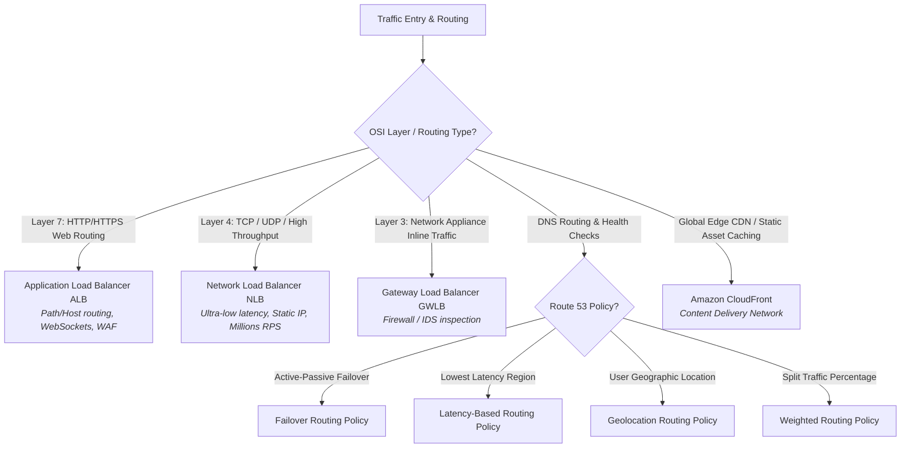

### 4.2 VPC Connectivity Decision Tree

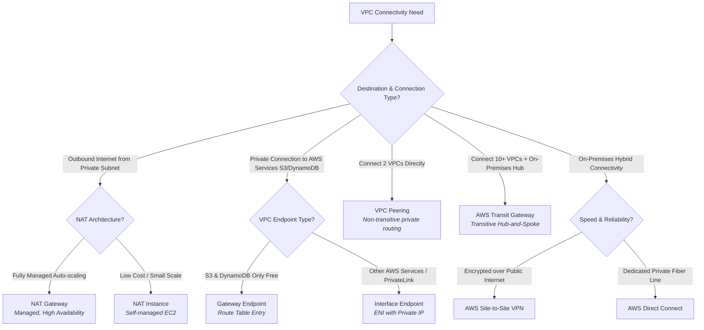

### 4.3 Networking Decision Matrix

| Requirement / Scenario | Primary Service | Alternative Service | Key Decision Rationale |
| :--- | :--- | :--- | :--- |
| **HTTP/HTTPS load balancing with URL path-based routing (`/api` vs `/static`)** | **Application Load Balancer (ALB)** | Network Load Balancer | Native Layer 7 features: host/path routing, OIDC auth, HTTP/2, WAF integration. |
| **Extreme high-throughput TCP/UDP traffic requiring static Elastic IPs** | **Network Load Balancer (NLB)** | ALB | Layer 4 traffic handling millions of requests/sec with sub-millisecond latency. |
| **Private S3 access from private subnet without passing over public Internet** | **VPC Gateway Endpoint** | VPC Interface Endpoint | Free to use; attached directly to VPC Route Tables for S3 and DynamoDB. |
| **Hub-and-spoke network routing across dozens of VPCs and AWS accounts** | **AWS Transit Gateway** | VPC Peering | Supports transitive routing; eliminates complex mesh of individual VPC peering connections. |
| **Dedicated 1 Gbps / 10 Gbps private connection from corporate data center to AWS** | **AWS Direct Connect** | AWS Site-to-Site VPN | Consistent network performance, reduced bandwidth costs, bypasses public internet. |

### 4.4 "If... Then..." Networking Rules
- **IF** routing HTTP/HTTPS traffic based on request headers or path, **THEN** use **ALB**.
- **IF** service requires extreme performance, static IP addresses, or non-HTTP TCP/UDP protocols, **THEN** use **NLB**.
- **IF** connecting private subnets to AWS S3/DynamoDB, **THEN** use **Gateway Endpoints** (free, route table based).
- **IF** connecting more than 5-10 VPCs in a transitive topology, **THEN** use **AWS Transit Gateway** instead of VPC Peering.

---

## Domain 5: Messaging, Integration & Event Streaming

### 5.1 Integration & Messaging Decision Tree

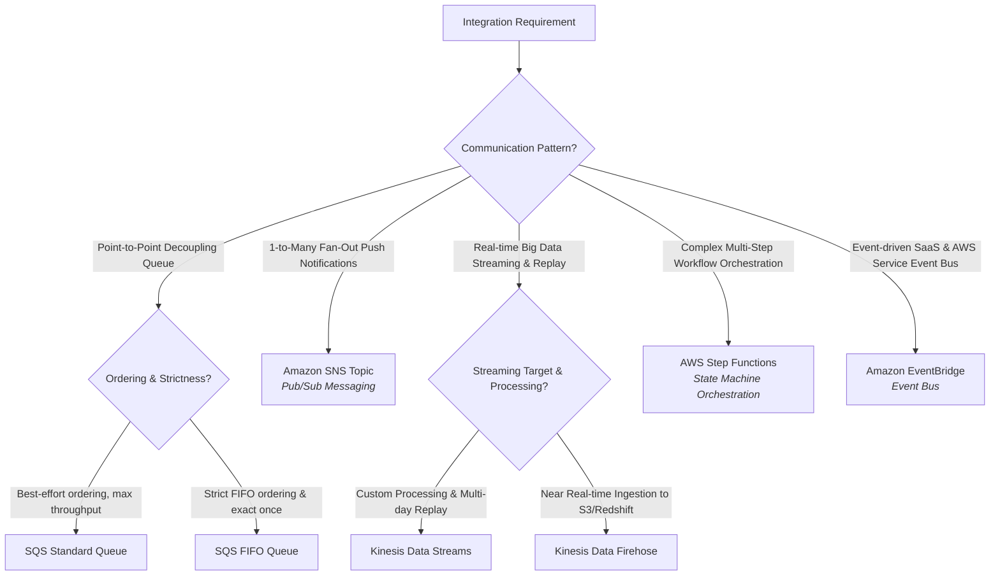

### 5.2 Messaging & Workflow Decision Matrix

| Requirement / Scenario | Primary Service | Alternative Service | Key Decision Rationale |
| :--- | :--- | :--- | :--- |
| **Decouple microservices using a buffer queue** | **Amazon SQS (Standard)** | Amazon SQS FIFO | Unlimited throughput, at-least-once delivery, message retention up to 14 days. |
| **Ensure financial transactions are processed in exact chronological order** | **Amazon SQS (FIFO)** | Kinesis Data Streams | Guarantees First-In-First-Out ordering and exactly-once processing (300 msgs/sec without batching). |
| **Broadcast a single event to SQS, Lambda, and Email simultaneously** | **Amazon SNS (Fan-out pattern)** | Amazon EventBridge | Push-based pub/sub topic that forwards messages to multiple endpoints concurrently. |
| **Real-time clickstream data ingestion with multi-consumer replay window** | **Kinesis Data Streams** | Kinesis Data Firehose | Low-latency stream processing with 1-365 days message replay capabilities. |
| **Continuous load of stream data into S3/Redshift without writing code** | **Kinesis Data Firehose** | Kinesis Data Streams | Fully managed serverless ingestion engine; automatically batches, converts (Parquet), and loads data. |
| **Orchestrate long-running multi-step serverless workflows with error handling** | **AWS Step Functions** | AWS Lambda (custom code) | Visual state machine with built-in retry logic, branch execution, and execution history. |

### 5.3 "If... Then..." Messaging Rules
- **IF** decoupling microservices with point-to-point asynchronous polling, **THEN** use **Amazon SQS**.
- **IF** broadcasting an event to multiple subscribers instantly via push, **THEN** use **Amazon SNS**.
- **IF** ingestion requires real-time data streaming with data replay capability, **THEN** use **Kinesis Data Streams**.
- **IF** orchestrating complex multi-step workflows with branch logic and retries, **THEN** use **AWS Step Functions**.

---

## Domain 6: Security, Encryption & Identity

### 6.1 Authentication & Secrets Decision Tree

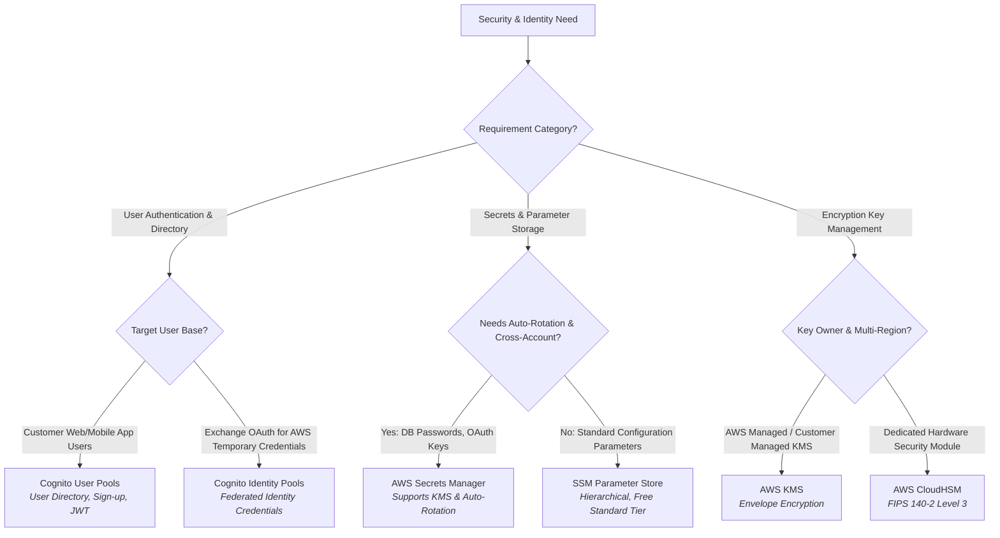

### 6.2 Security & Encryption Decision Matrix

| Requirement / Scenario | Primary Service | Alternative Service | Key Decision Rationale |
| :--- | :--- | :--- | :--- |
| **Customer sign-up, sign-in, MFA, and JWT token issuance for web app** | **Cognito User Pools (CUP)** | IAM Identity Center | Managed user directory supporting OAuth 2.0, SAML, and social identity providers (Google/FB). |
| **Grant temporary AWS IAM permissions to anonymous/federated app users** | **Cognito Identity Pools** | AWS STS AssumeRole | Exchanges CUP or third-party JWTs for short-lived temporary AWS credentials. |
| **Store database credentials requiring automatic 30-day password rotation** | **AWS Secrets Manager** | SSM Parameter Store | Native integration with AWS Lambda to automatically rotate RDS/Aurora passwords. |
| **Store application configuration strings and license keys at zero cost** | **SSM Parameter Store** | AWS Secrets Manager | Free standard tier; hierarchical parameter tree (`/config/dev/db_url`); KMS encryption support. |
| **Envelope encryption for S3 objects and EBS volumes** | **AWS KMS** | AWS CloudHSM | Fully integrated managed encryption service utilizing KMS Keys and Data Keys. |

### 6.3 "If... Then..." Security Rules
- **IF** managing user registration, logins, and MFA for a customer-facing app, **THEN** use **Cognito User Pools**.
- **IF** storing sensitive database credentials that require automatic rotation, **THEN** use **AWS Secrets Manager**.
- **IF** storing standard application parameters without auto-rotation requirements, **THEN** use **SSM Parameter Store**.
- **IF** compliance requires dedicated single-tenant FIPS 140-2 Level 3 hardware security modules, **THEN** use **AWS CloudHSM** instead of KMS.

---

## Domain 7: Monitoring, Auditing & Observability

### 7.1 Monitoring & Observability Decision Tree

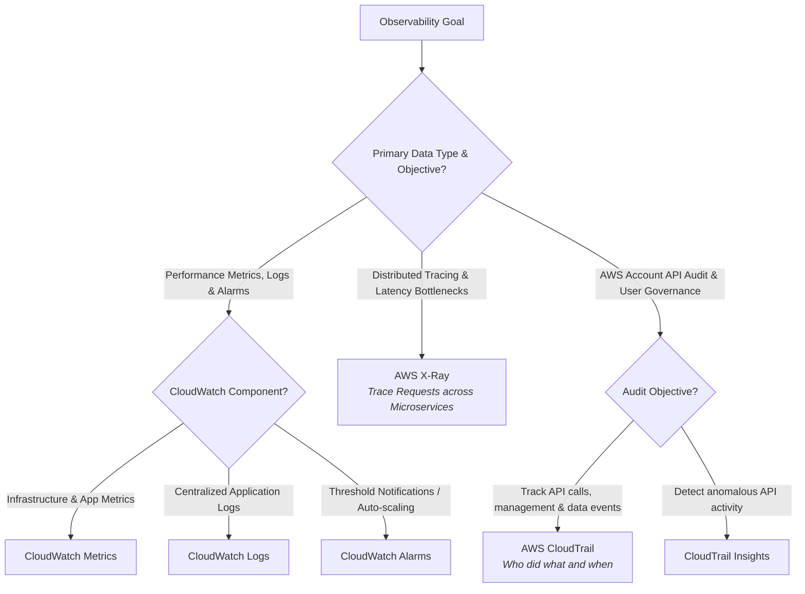

### 7.2 Observability Decision Matrix

| Requirement / Scenario | Primary Service | Alternative Service | Key Decision Rationale |
| :--- | :--- | :--- | :--- |
| **Monitor EC2 CPU utilization and trigger Auto Scaling** | **CloudWatch Metrics & Alarms** | EventBridge | Real-time metric collection and alarm threshold evaluation every 1 to 60 seconds. |
| **Troubleshoot latency spikes across a microservice chain (API Gateway $\rightarrow$ Lambda $\rightarrow$ DynamoDB)** | **AWS X-Ray** | CloudWatch ServiceLens | Generates visual end-to-end trace maps showing precise timing for each subsegment call. |
| **Investigate who deleted an S3 bucket or modified a Security Group rule** | **AWS CloudTrail** | CloudWatch Logs | Immutable log audit record of every API call made in the AWS account by user/role/IP. |
| **Detect unexpected API call spikes or unusual security configurations** | **CloudTrail Insights** | CloudWatch Anomaly Detection | Machine learning baseline analysis of CloudTrail management events to surface anomalies. |

### 7.3 "If... Then..." Observability Rules
- **IF** collecting performance metrics, logs, or setting up operational alerts, **THEN** use **AWS CloudWatch**.
- **IF** debugging distributed request paths and pinpointing latency bottlenecks across microservices, **THEN** use **AWS X-Ray**.
- **IF** performing security audits to verify who executed a specific AWS API call, **THEN** use **AWS CloudTrail**.

---

## Domain 8: DevOps, Infrastructure as Code & CI/CD

### 8.1 IaC & Deployment Strategy Decision Tree

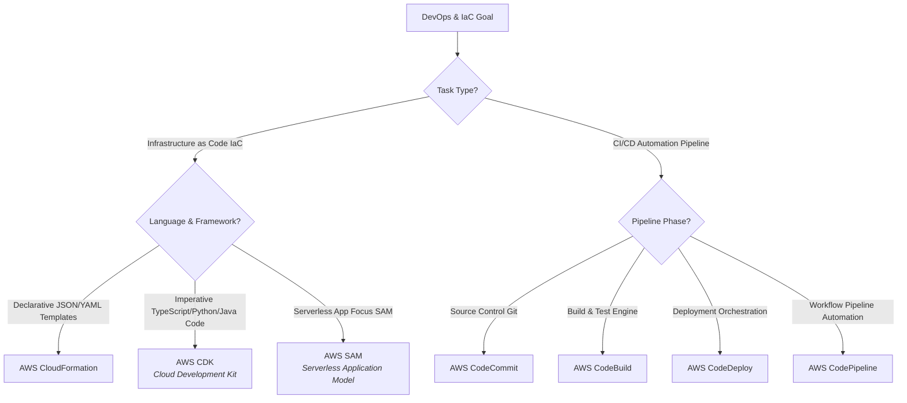

### 8.2 CodeDeploy Deployment Strategies Decision Matrix

| Deployment Strategy | Downtime | Rollback Speed | EC2 Capacity Required | Best Used For |
| :--- | :--- | :--- | :--- | :--- |
| **All-at-Once** | **Yes** | Slow | 100% | Fast deployment in non-production / dev environments. |
| **In-Place (Rolling)** | **No** | Medium | 100% | Production deployments without creating new instance capacity. |
| **Blue / Green** | **Zero** | **Instant (DNS/ELB Swap)** | **200% (Double)** | Mission-critical production applications requiring zero downtime. |
| **Canary** | **Zero** | Instant | 100% - 200% | Testing new releases against a small percentage ($5\%-10\%$) of real traffic. |

### 8.3 "If... Then..." DevOps Rules
- **IF** defining infrastructure using standard programming languages (TypeScript, Python), **THEN** use **AWS CDK**.
- **IF** deploying serverless applications (Lambda + API Gateway + DynamoDB), **THEN** use **AWS SAM**.
- **IF** deployment requires zero downtime and instant rollback capability, **THEN** choose **Blue/Green Deployment** via CodeDeploy.

---

## Domain 9: API Management & Edge Computing

### 9.1 API Gateway & Edge Compute Decision Tree

```mermaid
graph TD
    API_Start[API & Edge Request] --> Type{Traffic Type & Edge Logic?}
    
    Type -->|RESTful APIs / HTTP Endpoints| Gateway{API Feature Requirements?}
    Gateway -->|Cost-Optimized / Low Latency HTTP| HTTPAPI[API Gateway HTTP API<br><i>Up to 71% cheaper, faster</i>]
    Gateway -->|Advanced: Usage Plans, API Keys, WAF| RESTAPI[API Gateway REST API<br><i>Full feature set</i>]
    Gateway -->|Real-Time Stateful Bi-Directional| WSAPI[API Gateway WebSocket API]

    Type -->|Edge Compute Execution| EdgeType{Execution Complexity & Memory?}
    EdgeType -->|Lightweight Header Rewrites / Redirects| CFF[CloudFront Functions<br><i>JavaScript, sub-ms runtime</i>]
    EdgeType -->|Full Execution / External Network Calls| L_Edge[Lambda@Edge<br><i>Node.js/Python, up to 10s execution</i>]
```

### 9.2 "If... Then..." API Rules
- **IF** creating standard HTTP APIs without complex API management features, **THEN** choose **HTTP API** for maximum performance and $70\%$ lower cost.
- **IF** requirement demands API keys, usage plans, request validation, or direct AWS service integrations, **THEN** use **REST API**.
- **IF** executing simple header manipulation or URL rewrites at Edge locations in $< 1$ millisecond, **THEN** use **CloudFront Functions** instead of Lambda@Edge.

---

## Domain 10: Big Data, Analytics & Specialized Services

### 10.1 Analytics & Big Data Decision Tree

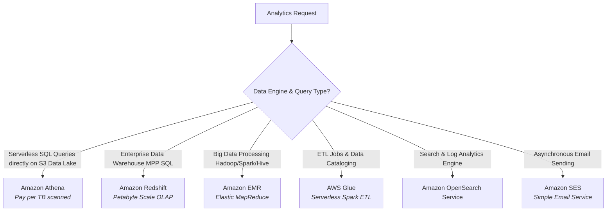

### 10.2 Analytics Decision Matrix

| Requirement / Scenario | Primary Service | Alternative Service | Key Decision Rationale |
| :--- | :--- | :--- | :--- |
| **Ad-hoc SQL queries on JSON/Parquet files stored in Amazon S3** | **Amazon Athena** | Amazon Redshift | Serverless engine; no database to provision; pay only per TB scanned. |
| **Automated ETL pipeline to clean and catalog raw S3 data** | **AWS Glue** | Amazon EMR | Serverless Spark execution environment with built-in Glue Data Catalog. |
| **Complex full-text search engine with visualization dashboards** | **Amazon OpenSearch** | CloudWatch Logs Insights | Native Elasticsearch alternative for indexing and querying unstructured text data. |
| **Transactional transactional email sending at scale** | **Amazon SES** | Amazon SNS | Built specifically for inbound/outbound transactional and marketing emails. |

---

## 📌 Summary Architecture Cheat Sheet

| Business / Tech Goal | Selected AWS Service | Primary Reason |
| :--- | :--- | :--- |
| **Event-driven microservice execution** | **AWS Lambda** | Zero server administration, auto-scaling execution under 15m. |
| **Microsecond read performance for DB** | **ElastiCache (Redis)** | In-memory key-value cache engine. |
| **Global CDN for web apps with DDoS protection** | **CloudFront + AWS Shield** | Edge location caching and origin shielding. |
| **Decouple microservices asynchronously** | **Amazon SQS** | High-throughput distributed message queue. |
| **Audit user actions for security compliance** | **AWS CloudTrail** | Immutable API logging across the AWS account. |
| **Automated password rotation for databases** | **AWS Secrets Manager** | Native Lambda integration for seamless secret rotation. |
